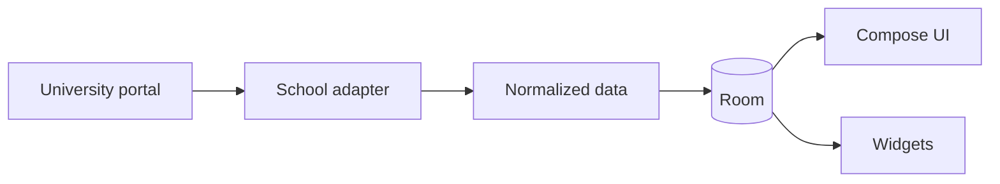

# Keshu · 课枢

[Website](https://huishingcheung.github.io/Keshu/) · [简体中文](README.zh-CN.md)

[](https://github.com/huishingcheung/Keshu/actions/workflows/android.yml)
[](LICENSE)
[](https://github.com/huishingcheung/Keshu/releases/download/v0.4.2/Keshu-v0.4.2-preview.apk)

**Classes, credits, tasks, and exams—organized around today.**

Keshu is a local-first Android academic companion. It imports records from a supported university portal and turns them into a daily overview, weekly timetable, curriculum progress, reminders, and home-screen widgets.

> [!NOTE]
> Keshu is an independent project, not an official university application. The current preview supports the Jinan University undergraduate academic system.

## Install

[Download Keshu v0.4.2 Preview](https://github.com/huishingcheung/Keshu/releases/download/v0.4.2/Keshu-v0.4.2-preview.apk) · [View all releases](https://github.com/huishingcheung/Keshu/releases)

Keshu requires Android 8.0 or later. The APK is distributed directly through GitHub Releases and is not currently available from an app store.

## Get started

1. Install and open Keshu.
2. Tap **Sync** in the top-right corner of Today and review the import notice.
3. Sign in through the university's official portal page.
4. Select **One-tap sync** and keep the sync screen open until each dataset reports a result.
5. Review the imported timetable, then set the semester start date and campus class times from the timetable menu.

Always verify important deadlines, rooms, and exam arrangements through an official university channel.

## Features

- A Today view for the next class, remaining classes, tasks, and exam status
- Curriculum and credit progress with an optional in-progress credit projection that updates the full credit tree
- A swipeable weekly timetable with campus time presets, custom class times, and local corrections
- Tasks with optional notification reminders
- Exam arrangements and reminders when the university makes them available
- Optional DeepSeek-powered course-planning suggestions with an in-app API key guide
- Light home-screen widgets for schedules, exams, and tasks

When exam viewing is closed, Keshu shows the university's published viewing window instead of reporting zero exams or failing the entire import.

## Supported data sources

| Data source | Curriculum | Timetable | Exams | Status |
| --- | :---: | :---: | :---: | --- |
| Jinan University undergraduate system | ✓ | ✓ | ✓ | Experimental |

School names describe compatibility only; the product and shared data model remain university-neutral.

## Privacy

- Portal sign-in happens on the university's own page; Keshu does not store the portal password.
- Imported academic records, tasks, and settings remain in local app storage and are excluded from Android backup and device transfer.
- Portal cookies and WebView storage can be cleared from the sync screen.
- Notification permission is requested only when a reminder is enabled.
- Course advice runs only on request. The relevant academic context is sent to DeepSeek, but the supplied API key is not saved.
- When the app is opened, it contacts GitHub at most once every three days to check the latest public release. Failed offline checks are retried the next time the app opens.

Never publish unredacted portal screenshots or logs. They may contain student identifiers, cookies, tokens, or authenticated links.

## Development

Requirements: Android Studio, JDK 17, and Android SDK Platform 35.

```bash
git clone https://github.com/huishingcheung/Keshu.git
cd Keshu
./gradlew testDebugUnitTest lintDebug assembleDebug
```

On Windows, replace `./gradlew` with `.\gradlew.bat`. The debug APK is generated at `.build/app/outputs/apk/debug/app-debug.apk`.

To run the app, open the repository root in Android Studio, wait for Gradle sync, and launch the `app` configuration on an Android 8.0 or newer emulator or device. A physical phone is not required.

## Architecture

Room is the local source of truth. Portal-specific adapters normalize imported records before persistence, while the Compose UI and RemoteViews widgets read local data.



The app uses Kotlin, Jetpack Compose with Material 3, Room, Coroutines, WorkManager, and WebView-based portal adapters.

## Project status

Keshu is preview software. Only one university data source is currently available, portal changes can temporarily break imports, and exams cannot be imported outside the university's viewing period.

## Help and contributing

Use [GitHub Issues](https://github.com/huishingcheung/Keshu/issues) for reproducible bugs and focused feature requests. Read [CONTRIBUTING.md](CONTRIBUTING.md) before proposing a substantial change, and remove all personal or authentication data from portal-related material.

## License

Keshu is licensed under [GPL-3.0-only](LICENSE). Distributed modifications must remain available under the same license. The project name and visual identity are covered separately by [TRADEMARKS.md](TRADEMARKS.md).

## Disclaimer

Keshu is not affiliated with, authorized by, or endorsed by Jinan University or any other university. Verify important academic information through official university systems.
