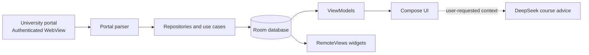

# Keshu · 课枢

[简体中文](README.zh-CN.md)

[](https://developer.android.com/about/versions/oreo)
[](https://kotlinlang.org/)
[](https://developer.android.com/compose)
[](https://github.com/huishingcheung/Keshu/actions/workflows/android.yml)

**Your classes, credits, tasks, and exams—organized around today.**

Keshu is an independent, local-first Android academic companion. It turns data from supported university portals into a calmer daily view, a weekly timetable, curriculum progress, reminders, and home-screen widgets.

The integration is designed to grow through school-specific data sources. The current preview supports the Jinan University undergraduate academic system.

> [!IMPORTANT]
> Keshu is under active development. The source tree may be ahead of published release assets, and current builds are intended for testing rather than high-stakes academic decisions.

## Highlights

| | Capability | What it does |
| --- | --- | --- |
| 🏠 | Today | Surfaces the next class, remaining classes, open tasks, and exam status. |
| 🎓 | Credit progress | Compares completed and in-progress credits with curriculum requirements. |
| 📅 | Weekly timetable | Browses teaching weeks and lets you correct imported class details locally. |
| ✅ | Tasks | Creates local tasks with optional notification reminders. |
| 📝 | Exams | Shows time, venue, seat, and reminders when the portal makes them available. |
| ✨ | Course advisor | Generates optional course-planning suggestions from the academic context you choose to send. |
| 🧩 | Widgets | Keeps today's classes, exam availability, and tasks on the home screen. |

When the university has not opened exam viewing, Keshu shows the published viewing window instead of reporting zero exams or treating the import as a total failure.

## Supported data sources

| Data source | Curriculum | Courses | Timetable | Exams | Status |
| --- | :---: | :---: | :---: | :---: | --- |
| Jinan University undergraduate system | ✓ | ✓ | ✓ | ✓ | Experimental |

School names describe compatibility only. Keshu itself is school-neutral and is not an official university application.

## Privacy by design

- Portal sign-in happens inside the university's own web page. Keshu does not store the portal password.
- Imported academic records, tasks, and settings stay in the app's local storage.
- Academic data, preferences, and portal state are excluded from Android backup and device transfer.
- The sync screen can clear portal cookies, WebView storage, and cache at any time.
- Notification permission is requested only after you enable a task reminder or schedule exam reminders.
- Course advice runs only when requested. The relevant curriculum and course context is then sent to DeepSeek, while the supplied API key is not saved.

Never post unredacted portal screenshots or logs. They may contain names, student numbers, cookies, tokens, or authenticated links.

## Getting started

1. Build and install Keshu on a device or emulator running Android 8.0 or later.
2. Open **Sync** and review the data-access notice.
3. Sign in on the supported university's official portal page.
4. Choose **One-tap sync** and keep the sync screen open until each dataset reports its result.
5. Check the imported timetable and set the semester start date when necessary.

The university controls when particular records are visible. Always verify important deadlines, rooms, and exam arrangements through an official channel.

## Build and run

### Requirements

- Android Studio
- JDK 17, or a compatible Android Studio embedded JDK
- Android SDK Platform 35
- Internet access for the first Gradle sync

### Android Studio

1. Clone this repository.
2. Open the repository root in Android Studio.
3. Install Android SDK Platform 35 from **SDK Manager** if prompted.
4. In **Settings → Build, Execution, Deployment → Build Tools → Gradle**, select `GRADLE_LOCAL_JAVA_HOME` or a compatible embedded JDK.
5. Wait for Gradle sync to finish.
6. Select the `app` run configuration and create or select an Android emulator.
7. Choose **Run**.

No physical phone is required. An Android Virtual Device running API 35 is suitable for development and UI testing.

The current checkout includes `gradlew.bat` but not the Unix `gradlew` launcher. On Windows, command-line builds are available with:

```powershell
git clone https://github.com/huishingcheung/Keshu.git
cd Keshu
.\gradlew.bat assembleDebug
```

The generated APK is located at:

```text
.build/app/outputs/apk/debug/app-debug.apk
```

The application ID is `com.keshu.mobile`.

## Architecture

Keshu uses Room as the local source of truth. Portal access is intentionally isolated from normal app use: an authenticated WebView imports selected records, then the Compose UI and widgets read from local storage.



```text
app/src/main/java/com/keshu/mobile/
├── data/           Room, portal parsing, repositories, and network clients
├── domain/         Models and use cases
├── presentation/   Compose screens, theme, and sync workflow
├── background/     Task and exam reminders
└── widget/         Home-screen widgets and refresh work
```

### Technology

- Kotlin and Coroutines
- Jetpack Compose with Material 3
- Room
- Retrofit, OkHttp, Moshi, and jsoup
- WorkManager and Android alarms
- Android App Widgets with RemoteViews
- WebView-based portal integration

## Quality checks

The repository's GitHub Actions workflow builds the debug APK on pushes and pull requests targeting `main`. On Windows, the same build and static analysis can be run with:

```powershell
.\gradlew.bat assembleDebug
.\gradlew.bat lintDebug
```

Focused tests that do not depend on private portal captures can be run with:

```powershell
.\gradlew.bat testDebugUnitTest `
  --tests "com.keshu.mobile.domain.*" `
  --tests "com.keshu.mobile.data.repository.*" `
  --tests "com.keshu.mobile.presentation.sync.*" `
  --tests "com.keshu.mobile.widget.*"
```

Some legacy parser tests reference private HTML fixtures that are intentionally absent from the repository. Replacing them with sanitized, synthetic fixtures is tracked as project work.

## Current limitations

- Only the Jinan University undergraduate academic system is currently supported.
- Portal markup and session behavior can change without notice and may temporarily break imports.
- Exam arrangements cannot be imported outside the viewing period set by the university.
- Published builds are preview builds and are not distributed through an app store.
- macOS and Linux command-line builds need the missing Unix Gradle wrapper launcher to be restored.

## Roadmap

- Make portal imports faster and independently recoverable for each dataset.
- Add sanitized parser fixtures and reproducible clean-clone tests.
- Split the main Compose surface into smaller feature modules.
- Define a stable adapter contract for additional university systems.
- Prepare release signing and distribution only after the core sync path is stable.

## Feedback and contributions

Use [GitHub Issues](https://github.com/huishingcheung/Keshu/issues) for reproducible bugs and focused feature requests. Before attaching portal-related material, remove all personal and authentication data.

The repository does not yet contain a contribution guide or an open-source license. Until those policies are added, please use Issues to discuss a proposed change before investing substantial work.

## Disclaimer

Keshu is an independent student project. It is not affiliated with, authorized by, or endorsed by Jinan University or any other university. School names identify compatible data sources only. Users remain responsible for verifying academic information against official university systems.
