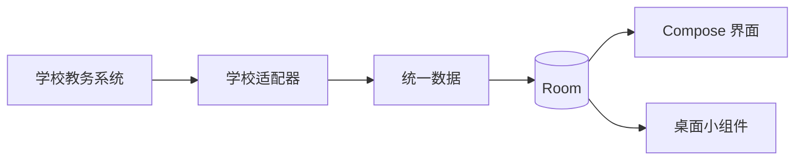

# 课枢 · Keshu

[项目网站](https://huishingcheung.github.io/Keshu/) · [English](README.md)

[](https://github.com/huishingcheung/Keshu/actions/workflows/android.yml)
[](LICENSE)
[](https://github.com/huishingcheung/Keshu/releases/download/v0.4.1/Keshu-v0.4.1-preview.apk)

**围绕今天，整理好课程、学分、待办与考试。**

课枢是一款本地优先的 Android 学业伴侣。它从受支持的学校教务系统导入记录，并整理成今日概览、周课表、培养方案进度、提醒和桌面小组件。

> [!NOTE]
> 课枢是独立项目，不是学校官方应用。当前预览版支持暨南大学本科教务系统。

## 安装

[下载课枢 v0.4.1 预览版](https://github.com/huishingcheung/Keshu/releases/download/v0.4.1/Keshu-v0.4.1-preview.apk) · [查看全部版本](https://github.com/huishingcheung/Keshu/releases)

课枢需要 Android 8.0 或更高版本。APK 目前仅通过 GitHub Releases 直接分发，尚未上架应用商店。

## 开始使用

1. 安装并打开课枢。
2. 打开**同步**，阅读数据访问说明。
3. 在学校官方教务页面完成登录。
4. 选择**一键同步**，保持同步页面开启，直至各项数据分别显示结果。
5. 检查导入后的课表，并在需要时设置学期开始日期。

重要截止日期、教室和考试安排请始终通过学校官方渠道复核。

## 功能

- 在“今天”查看下一节课、剩余课程、待办和考试状态
- 查看培养方案与学分进度，并按需计入在修学分
- 滑动切换周课表，并在本地修正课程安排
- 创建待办并选择是否启用通知提醒
- 在学校开放查询时导入考试安排并设置提醒
- 按需使用 DeepSeek 生成选课建议
- 使用浅色课表、考试与待办桌面小组件

学校尚未开放考试查询时，课枢会显示教务系统公布的可查看时间，而不是报告零场考试或让整次导入失败。

## 支持的数据源

| 数据源 | 培养方案 | 课表 | 考试 | 状态 |
| --- | :---: | :---: | :---: | --- |
| 暨南大学本科教务系统 | ✓ | ✓ | ✓ | 实验性支持 |

学校名称只用于说明兼容性；产品本身及共用数据模型保持学校中立。

## 隐私

- 教务登录在学校自己的网页内完成，课枢不会保存教务密码。
- 导入的教务记录、待办和设置保存在应用本地，并排除在 Android 备份和设备迁移之外。
- 可从同步页面清除教务 Cookie 和 WebView 存储。
- 仅在启用提醒时申请通知权限。
- 选课建议只在用户主动请求时运行；相关学业上下文会发送给 DeepSeek，但输入的 API Key 不会保存。

请勿公开未经脱敏的教务截图或日志，其中可能包含学号、Cookie、Token 或认证链接。

## 开发

环境要求：Android Studio、JDK 17 和 Android SDK Platform 35。

```bash
git clone https://github.com/huishingcheung/Keshu.git
cd Keshu
./gradlew testDebugUnitTest lintDebug assembleDebug
```

Windows 请将 `./gradlew` 替换为 `.\gradlew.bat`。调试 APK 位于 `.build/app/outputs/apk/debug/app-debug.apk`。

如需运行应用，请在 Android Studio 中打开仓库根目录，等待 Gradle 同步完成，再在 Android 8.0 或更高版本的模拟器或设备上运行 `app`。无需连接实体手机。

## 架构

Room 是本地唯一可信数据源。学校适配器先将教务记录转换为统一数据再写入本地；Compose 界面和 RemoteViews 小组件读取本地数据。



项目使用 Kotlin、Jetpack Compose 与 Material 3、Room、Coroutines、WorkManager，以及基于 WebView 的教务适配器。

## 项目状态

课枢仍处于预览阶段。目前只有一个学校数据源；教务系统变化可能暂时破坏导入；学校规定的可查看时间以外无法导入考试安排。

## 获取帮助与参与贡献

请通过 [GitHub Issues](https://github.com/huishingcheung/Keshu/issues) 提交可复现问题和明确需求。准备较大修改前请阅读 [CONTRIBUTING.md](CONTRIBUTING.md)，教务相关材料必须移除全部个人与认证数据。

## 许可证

课枢采用 [GPL-3.0-only](LICENSE)。分发修改版本时必须继续按照相同许可证提供对应源码。项目名称与视觉标识另由 [TRADEMARKS.md](TRADEMARKS.md) 说明。

## 声明

课枢与暨南大学或任何其他学校不存在隶属、授权或官方认可关系。重要教务信息请通过学校官方系统核对。
