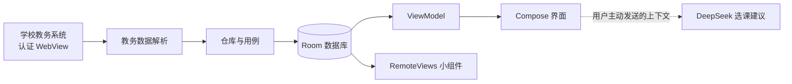

# 课枢 · Keshu

[English](README.md)

[](https://developer.android.com/about/versions/oreo)
[](https://kotlinlang.org/)
[](https://developer.android.com/compose)
[](https://github.com/huishingcheung/Keshu/actions/workflows/android.yml)
[](https://github.com/huishingcheung/Keshu/releases/download/v0.3.1/Keshu-v0.3.1-preview.apk)

**围绕今天，整理好课程、学分、待办与考试。**

课枢是一款独立开发、本地优先的 Android 学业伴侣。它把受支持教务系统中的数据整理成清晰的今日概览、周课表、培养方案进度、提醒和桌面小组件。

教务接入将通过学校数据源逐步扩展；当前预览版支持暨南大学本科教务系统。

> [!IMPORTANT]
> 课枢仍在持续开发。源码可能领先于已发布的安装包，当前构建仅适合测试，不应作为重要教务决定的唯一依据。

## 下载

[下载课枢 v0.3.1 预览版](https://github.com/huishingcheung/Keshu/releases/download/v0.3.1/Keshu-v0.3.1-preview.apk) · [查看全部版本](https://github.com/huishingcheung/Keshu/releases)

预览版 APK 使用调试签名，仅供体验与测试。课枢采用新的应用 ID `com.keshu.mobile`，因此会与早期 JNU Smart Edu 版本分别安装，也不会迁移旧版本的本地数据。

## 功能亮点

| | 功能 | 用途 |
| --- | --- | --- |
| 🏠 | 今天 | 集中显示下一节课、今日剩余课程、未完成待办和考试状态。 |
| 🎓 | 学分进度 | 对照培养方案查看已修、在修和毕业要求学分。 |
| 📅 | 周课表 | 切换教学周，并在本地修正导入的课程安排。 |
| ✅ | 待办 | 创建本地待办，并按需开启通知提醒。 |
| 📝 | 考试 | 在学校开放查询时显示时间、地点、座位和提醒。 |
| ✨ | 选课顾问 | 根据用户主动选择发送的学业上下文生成选课建议。 |
| 🧩 | 桌面小组件 | 在桌面查看今日课程、考试状态和待办任务。 |

学校尚未开放考试查询时，课枢会显示教务系统公布的可查看时间，而不是错误地报告“零场考试”或让整次导入失败。

## 支持的数据源

| 数据源 | 培养方案 | 课程 | 课表 | 考试 | 状态 |
| --- | :---: | :---: | :---: | :---: | --- |
| 暨南大学本科教务系统 | ✓ | ✓ | ✓ | ✓ | 实验性支持 |

学校名称仅用于说明兼容性。课枢本身保持学校中立，也不是学校官方应用。

## 隐私设计

- 教务登录在学校自己的网页内完成，课枢不会保存教务密码。
- 导入的教务记录、待办和设置保存在应用本地。
- 教务数据、偏好和登录状态均排除在 Android 备份与设备迁移之外。
- 可随时在同步页面清除教务 Cookie、WebView 网页存储和缓存。
- 仅在用户开启待办提醒或设置考试提醒后申请通知权限。
- 选课建议只会在用户主动请求时运行。届时相关培养方案和课程上下文会发送给 DeepSeek，但输入的 API Key 不会保存。

请勿公开未经脱敏的教务截图或日志，其中可能包含姓名、学号、Cookie、Token 或带认证信息的链接。

## 开始使用

1. 在 Android 8.0 或更高版本的设备或模拟器上构建并安装课枢。
2. 打开“同步”，阅读数据访问说明。
3. 在受支持学校的官方教务网页中登录。
4. 选择“一键同步”，保持同步页面打开，直到各类数据分别显示结果。
5. 检查导入的课表，并按需设置学期开学日期。

具体数据是否开放由学校教务系统决定。重要截止时间、教室和考试安排请始终通过学校官方渠道核对。

## 构建与运行

### 环境要求

- Android Studio
- JDK 17，或兼容的 Android Studio 内置 JDK
- Android SDK Platform 35
- 首次 Gradle 同步所需的网络连接

### Android Studio

1. 克隆本仓库。
2. 在 Android Studio 中打开仓库根目录。
3. 如有提示，在 **SDK Manager** 中安装 Android SDK Platform 35。
4. 前往 **Settings → Build, Execution, Deployment → Build Tools → Gradle**，选择 `GRADLE_LOCAL_JAVA_HOME` 或兼容的内置 JDK。
5. 等待 Gradle 同步完成。
6. 选择 `app` 运行配置，并创建或选择 Android 模拟器。
7. 点击 **Run**。

运行项目不需要连接实体手机。使用 API 35 的 Android Virtual Device 即可完成开发和界面测试。

当前仓库包含 `gradlew.bat`，但缺少 Unix 平台的 `gradlew` 启动脚本。在 Windows 上可使用命令行构建：

```powershell
git clone https://github.com/huishingcheung/Keshu.git
cd Keshu
.\gradlew.bat assembleDebug
```

生成的 APK 位于：

```text
.build/app/outputs/apk/debug/app-debug.apk
```

应用 ID 为 `com.keshu.mobile`。

## 架构

课枢以 Room 作为本地数据源。教务访问与日常使用相互隔离：经过认证的 WebView 负责导入用户选择的数据，Compose 界面和小组件随后只读取本地存储。



```text
app/src/main/java/com/keshu/mobile/
├── data/           Room、教务解析、仓库与网络客户端
├── domain/         领域模型与用例
├── presentation/   Compose 界面、主题与同步流程
├── background/     待办与考试提醒
└── widget/         桌面小组件与刷新任务
```

### 技术栈

- Kotlin 与 Coroutines
- Jetpack Compose 与 Material 3
- Room
- Retrofit、OkHttp、Moshi 与 jsoup
- WorkManager 与 Android 闹钟
- 基于 RemoteViews 的 Android 桌面小组件
- 基于 WebView 的教务系统集成

## 质量检查

仓库中的 GitHub Actions 会在推送到 `main` 或向 `main` 提交拉取请求时构建调试 APK。在 Windows 上可以运行相同的构建和静态检查：

```powershell
.\gradlew.bat assembleDebug
.\gradlew.bat lintDebug
```

不依赖私有教务页面样本的测试可以这样运行：

```powershell
.\gradlew.bat testDebugUnitTest `
  --tests "com.keshu.mobile.domain.*" `
  --tests "com.keshu.mobile.data.repository.*" `
  --tests "com.keshu.mobile.presentation.sync.*" `
  --tests "com.keshu.mobile.widget.*"
```

部分旧版解析器测试引用了未上传到仓库的私有 HTML 样本。后续会使用经过脱敏的合成测试样本替换它们。

## 当前限制

- 目前只支持暨南大学本科教务系统。
- 教务页面结构和会话行为可能随时变化，并暂时影响导入。
- 学校规定的可查看时间以外无法导入考试安排。
- 当前发布构建属于预览版，尚未通过应用商店分发。
- macOS 和 Linux 的命令行构建仍需补回缺失的 Unix Gradle Wrapper 启动脚本。

## 路线图

- 提升教务导入速度，并让每类数据都能独立恢复。
- 添加脱敏解析样本，使全新克隆后的测试可复现。
- 将主 Compose 界面拆分为更小的功能模块。
- 为更多学校教务系统定义稳定的数据源适配协议。
- 在核心同步流程稳定后准备发布签名与分发。

## 反馈与贡献

如需提交可复现的问题或明确的功能建议，请使用 [GitHub Issues](https://github.com/huishingcheung/Keshu/issues)。上传教务相关材料前，请移除全部个人信息和认证数据。

仓库目前还没有贡献指南或开源许可证。在相关规则补充之前，如准备投入较多工作，请先通过 Issue 讨论修改方向。

## 声明

课枢是独立开发的学生项目，与暨南大学或任何其他学校不存在隶属、授权或官方认可关系。学校名称仅用于标识兼容的数据源。用户仍需通过学校官方系统核对教务信息。
